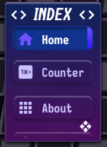
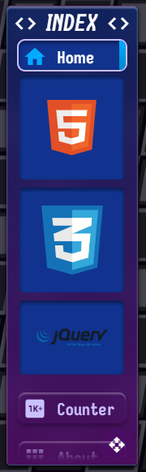
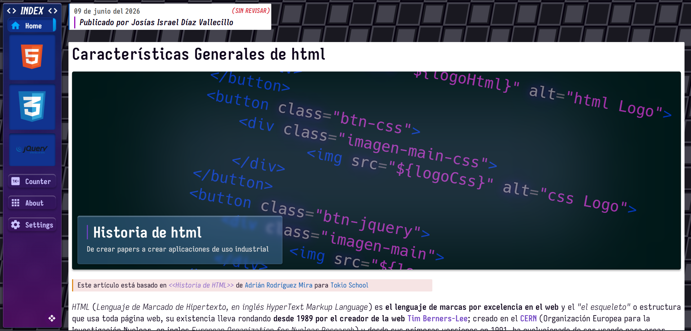
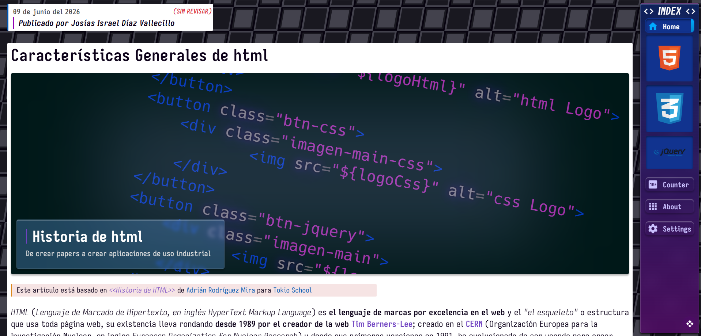
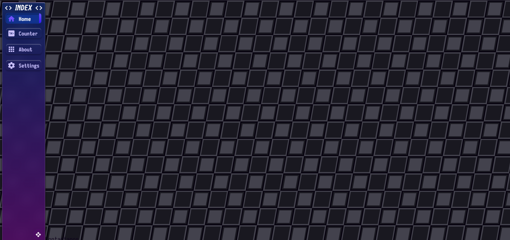
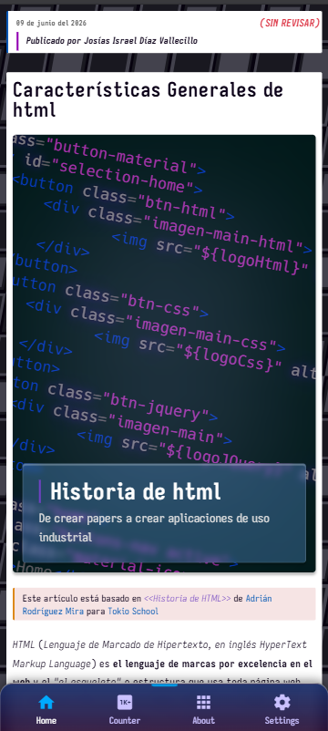
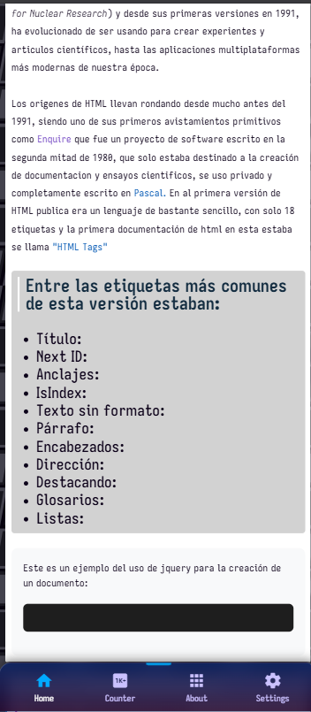

# Init-JQuery

This is an initial project for a university assignment, aimed at learning HTML, CSS, and TypeScript with jQuery for HTML querying (DOM manipulation) and partially achieving React-like component behavior.

## Examples

### On desktop

### On Mobile

## Authors

- [@CatChaos](https://github.com/CatChaos2025)
